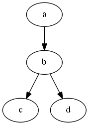

# dorothy   

[Hiccup-style](https://github.com/weavejester/hiccup) generation of
[Graphviz](http://www.graphviz.org/) graphs in Clojure and ClojureScript.

*Dorothy is extremely alpha and subject to radical change. [Release Notes Here](https://github.com/daveray/dorothy/wiki)*

## Usage

*Dorothy assumes you have an understanding of Graphviz and DOT. The text below describes the mechanics of Dorothy's DSL, but you'll need to refer to the Graphviz documentation for specifics on node shapes, valid attributes, etc.*

*The Graphviz dot tool executable must be on the system path to render*

Dorothy is on Clojars. In Leiningen:

    [dorothy "x.y.z"]

A graph consists of a vector of *statements*. The following sections describe the format for all the types of statements. If you're bored, skip ahead to the "Defining Graphs" section below.

### Node Statement
A *node statement* defines a node in the graph. It can take two forms:

    node-id

    [node-id]

    [node-id { attr map }]

where `node-id` is a string, number or keyword with optional trailing *port* and *compass-point*. Here are some node statement examples:

    :node0          ; Define a node called "node0"

    :node0:port0    ; Define a node called "node0" with port "port0"

    :node0:port0:sw ; Similarly a node with southwest compass point

the node's attr map is a map of attributes for the node. For example,

    [:start {:shape :Mdiamond}]
    ; => start [shape=Mdiamond];

Dorothy will correctly escape and quote node-ids as required by dot.

A node id can also be auto-generated with `(gen-id object)`. For example,

    [(gen-id some-object) {:label (.getText some-object)}]

It allows you to use arbitrary objects as nodes.

### Edge Statement
An *edge statement* defines an edge in the graph. It is expressed as a vector with two or more node-ids followed optional attribute map:

    [node-id0 node-id1 ... node-idN { attr map }]
    ; => "node-id0" -> "node-id1" -> ... -> "node-idN" [attrs ...];

In addition to node ids, an edge statement may also contain subgraphs:

    [:start (subgraph [... subgraph statements ...])]

For readability, `:>` delimiters may be optionally included in an edge statement:

    [:start :> :middle :> :end]

### Graph Attribute Statement

A *graph attribute* statement sets graph-wide attributes. It is expressed as a single map:

    {:label "process #1", :style :filled, :color :lightgrey}
    ; => graph [label="process #1",style=filled,color=lightgrey];

alternatively, this can be expressed with the `(graph-attrs)` function like this:

    (graph-attrs {:label "process #1", :style :filled, :color :lightgrey})
    ; => graph [label="process #1",style=filled,color=lightgrey];

### Node and Edge Attribute Statement
A *node attribute* or *edge attribute* statement sets node or edge attributes respectively for all nodes and edge statements that follow. It is expressed with `(node-attrs)` and `(edge-attrs)` statements:

    (node-attrs {:style :filled, :color :white})
    ; => node [style=filled,color=white];

or:

    (edge-attrs {:color :black})
    ; => edge [color=black];

## Defining Graphs
As mentioned above, a graph consists of a series of statements. These statements are passed to the `graph`, `digraph`, or `subgraph` functions. Each takes an optional set of attributes followed by a vector of statements:

    ; From http://www.graphviz.org/content/cluster
    (digraph [
      (subgraph :cluster_0 [
        {:style :filled, :color :lightgrey, :label "process #1"}
        (node-attrs {:style :filled, :color :white})

        [:a0 :> :a1 :> :a2 :> :a3]])

      (subgraph :cluster_1 [
        {:color :blue, :label "process #2"}
        (node-attrs {:style :filled})

        [:b0 :> :b1 :> :b2 :> :b3]])

      [:start :a0]
      [:start :b0]
      [:a1    :b3]
      [:b2    :a3]
      [:a3    :a0]
      [:a3    :end]
      [:b3    :end]

      [:start {:shape :Mdiamond}]
      [:end   {:shape :Msquare}]])

Similarly for `(graph)` (undirected graph) and `(subgraph)`. A second form of these functions takes an initial option map, or a string or keyword id for the graph:

    (graph :graph-id ...)
    ; => graph "graph-id" { ... }

    (digraph { :id :G :strict? true } ...)
    ; => strict graph G { ... }

## Generate Graphviz dot format

Given a graph built with the functions described above, use the `(dot)` function to generate Graphviz DOT output.

    (require '[dorothy.core :as dot])
    (def g (dot/graph [ ... ]))
    (dot/dot g)
    "graph { ... }"

## Rendering images (ClojureScript)

Dorothy currently doesn't include any facilities for rendering dot-format output to images. However,
you can pull in [viz.cljc](https://github.com/jebberjeb/viz.cljc) or
[viz.js](https://github.com/mdaines/viz.js), both of which will allow you to produce
png, svg, and other image formats from your dorothy-generated dot-formatted graph content.

Wanted: pull requests to implement node equivalents to the rendering functions available for Clojure/JVM
in the `dorothy.jvm` namespace. **link to github issue here**

## Render images via `graphviz` (Clojure/JVM)

Once you have DOT language output, you can render it as an image using the `(render)` function:

    (require '[dorothy.jvm :refer (render save! show!)])

    ; This produces a png as an array of bytes
    (render graph {:format :png})

    ; This produces an SVG string
    (render graph {:format :svg})

    ; A one-liner with a very simple 4 node digraph.
    (-> (dot/digraph [ [:a :b :c] [:b :d] ])
        dot/dot
        (render {:format :svg}))

*The dot tool executable must be on the system path*

other formats include `:pdf`, `:gif`, etc. The result will be either a java byte array, or String depending on whether the format is binary or not. `(render)` returns a string or a byte array depending on whether the output format is binary or not.

Alternatively, use the `(save!)` function to write to a file or output stream.

    ; A one-liner with a very simple 4 node digraph
    (-> (dot/digraph [ [:a :b :c] [:b :d] ])
        dot/dot
        (save! "out.png" {:format :png}))

Finally, for simple tests, use the `(show!)` function to view the result in a simple Swing viewer:

    ; This opens a simple Swing viewer with the graph
    (show! graph)

    ; A one-liner with a very simple 4 node digraph
    (-> (dot/digraph [ [:a :b :c] [:b :d] ])
        dot/dot
        show!)

which shows:

## License

Copyright (C) 2011-2017 Dave Ray and contributors

Distributed under the Eclipse Public License, the same as Clojure.
